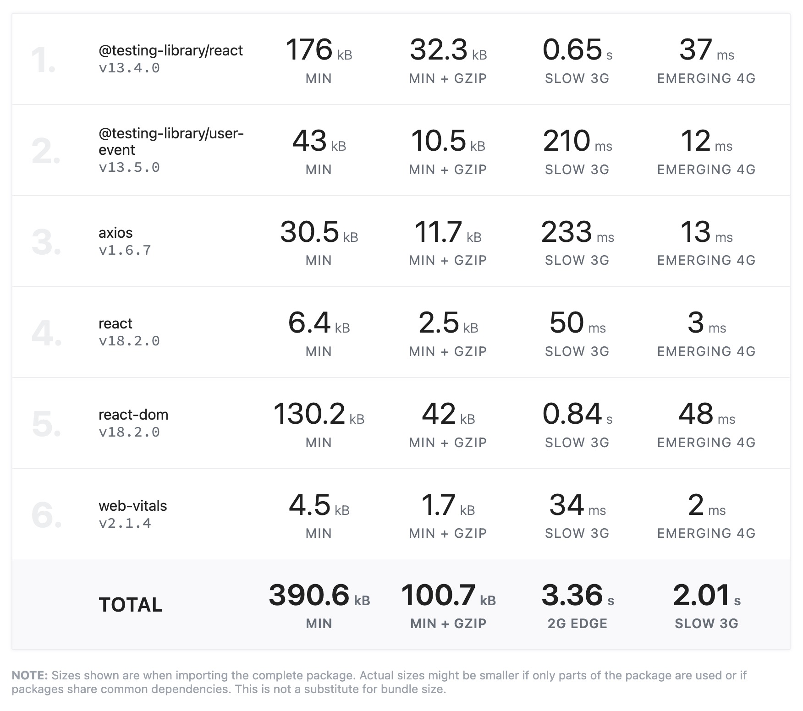

# SpaceX Launch Viewer

A React pilot that allows users to view SpaceX launches. The application fetches launch data from the SpaceX API and displays a random launch image along with other bits and bobs such as the launch name and date.

## Demo

🛰️ [Available on Vercel](https://spacex-launch-viewer.vercel.app/)

## Installation

To use this project, follow these steps:

1. Clone the repository:

    ```bash
    git clone https://github.com/behnum/spacex-launch-viewer.git
    ```

2. Change into the project directory:

    ```bash
    cd spacex-launch-viewer
    ```

3. Install dependencies:

    ```bash
    npm install
    ```

## Usage

To start the application, run the following command:

```bash
npm start
```

The application will be running at [http://localhost:3000](http://localhost:3000).

## Bundle Size


Credits: [bundlephobia.com](https://bundlephobia.com)

## Credits

The following resources/ideas were used in the creation of this project:

- [SpaceX API](https://github.com/r-spacex/SpaceX-API) 🚀
- [Tailwind CSS](https://tailwindcss.com/) 📏
- [Stars: a CodePen by sarazond](https://codepen.io/sarazond/full/LYGbwj) 🌟
- [Glowing Gradient Button: a CodePen by Denis](https://codepen.io/deniscreative/pen/jObmdNW) 🔆
- [Din Psykolog](https://dinpsykolog.se/) for their idea / instructions for this endeavour. 💚

## License

[MIT](https://choosealicense.com/licenses/mit/)
